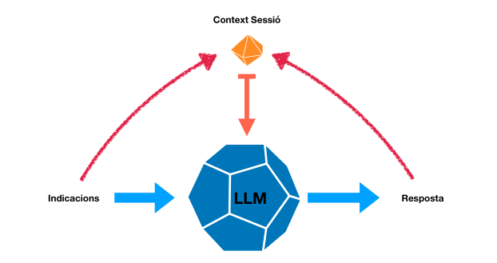

#  amep-apunts-artuaragon | IA Generativa | ABRIL 2024 | 

## Index

| RESUMS |                                    T1                                     |                                  T2                                   | IA Generativa | Agile QUABU
| :---: | :-----------------------------------------------------------------------: | :-------------------------------------------------------------------: | :-: |:-: |
| Link  |  | || |

# IA Generativa i Enginyeria del Software, Marc Alier

### LLM (Large Language Model): 

Un LLM (Large Language Model) és un tipus de model d'intel·ligència artificial dissenyat per comprendre i generar text de manera similar a com ho faria un humà. Aquests models són capaços d'aprendre patrons i estructures lingüístiques a partir de grans quantitats de dades de text i després poden generar text coherent i rellevant en resposta a una entrada donada.

El entrenament d'un LLM implica diverses etapes:

1. **Recopilació de dades**: Es reuneixen grans quantitats de text de diverses fonts, com ara llibres, articles de notícies, llocs web, entre altres. És fonamental que aquestes dades siguin representatives de la diversitat lingüística i temàtica perquè el model adquireixi un coneixement ampli del llenguatge.

2. **Preprocessament de dades**: Abans de alimentar les dades al model, és necessari realitzar un processament prèvi per netejar el text, tokenitzar-lo (dividir-lo en unitats com ara paraules o caràcters), i preparar-lo en el format adequat per a l'entrenament.

3. **Entrenament del model**: S'utilitza un algorisme d'aprenentatge automàtic, com ara l'aprenentatge supervisat o l'aprenentatge per reforç, per entrenar el model amb les dades recopilades. Durant aquest procés, el model ajusta els seus paràmetres interns per minimitzar la discrepància entre la sortida predita i la sortida esperada.

4. **Ajust fin (fine-tuning)**: En alguns casos, després de l'entrenament inicial, el model pot sotmetre's a un procés addicional d'ajust fin utilitzant dades específiques per a una tasca o domini particular. Això pot ajudar el model a millorar el seu rendiment en tasques específiques.

5. **Avaluació i ajust**: Es valora el rendiment del model utilitzant mètriques adequades, com ara la precisió o la coherència del text generat. Si el model no compleix amb els estàndards desitjats, es poden realitzar ajustos addicionals en les dades d'entrenament, l'arquitectura del model o els hiperparàmetres per millorar el seu rendiment.

6. **Desplegament i ús**: Una vegada que el model ha estat entrenat satisfactòriament i ha demostrat la seva capacitat per generar text de qualitat, pot ser desplegat per a ús en diverses aplicacions, com ara assistents virtuals, generació de contingut, traducció automàtica, entre altres.

En resum, l'entrenament d'un LLM implica l'alimentació de grans quantitats de dades de text, l'ajust dels paràmetres del model a través de l'aprenentatge automàtic, i l'avaluació contínua per millorar el seu rendiment i utilitat en diverses aplicacions.

