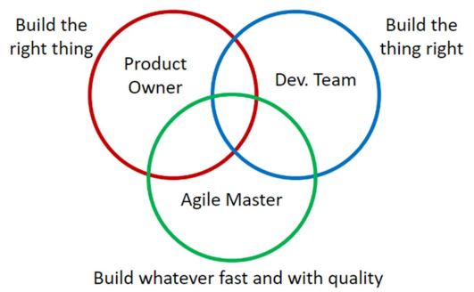
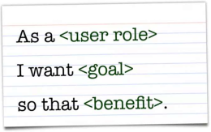

#  amep-apunts-artuaragon | TEMA 1 | DL 8 ABRIL 2024 | 

## Index

| RESUMS |                                    T1                                     |                                  T2                                   | IA Generativa | Agile QUABU
| :---: | :-----------------------------------------------------------------------: | :-------------------------------------------------------------------: | :-: |:-: |
| Link  |  | || |

# Capitol 1. introducció a les Metodologies Agile.

## Cicle de vida del software

- Proces de desenvolupament:
    - Problema -> Proces de desenvolupament -> Solucio (Sis. Software).
    - Compost per diverses etapes:
    
    |     ETAPA     |             OBJECTIU              |                 RESULTAT                 |                  ROL                  |
    | :-----------: | :-------------------------------: | :--------------------------------------: | :-----------------------------------: |
    | Especificacio |  Definir i especificar requisits  | Document requsists, Model Especificacio  |         Enginyer de requisits         |
    |    Disseny    |  Estructurar el sistema software  | Arquitectura sistema, Components sistema |          Arquitecte software          |
    | Implementacio |   Programar el sistema software   |      Codi, Scripts, Bases de dades       |            Desenvolupador             |
    |    Proves     | Validar la correctesa del sistema |     Jocs de proves, Estudi qualitat      | Provador (tester), Gestor de qualitat |
    | Desplegament  | Posar el sistema en funcionament  |         Sistema en funcionament          | Enginyer sistemes, Administardor BDs  |
    |   Operacio    | Us del sistema pels seus usuaris  |   Sistema en us, Dades monitoritzacio    |      Operador, Analista de dades      |

    - Dirigits per un plan o Agils
      - INEP: C.V. Dirigit per un plan.
      - AMEP: C.V. Agil.

- Metodologies Agil (Agile Manisfesto, 2001):
  - INDIVIDIUALS AND INTERACTIONS over processes and tools.
  - WORKING SOFTWARE over comprehensive documentation.
  - CUSTOMER COLLABORATION over contract negotiation.
  - RESPONDING TO CHANGE over following plan.

    PRINCIPS:

    - Early and continous delivery of valuable software.
    - Changing requirements.
    - Business people and developers work together.
    - Motivated individuals.
    - Face-to-face converation.
    - Sustainable development.
    - TEchnical excellence.
    - Simplicity (Maximizing the amount of work not done).
    - Selft-organazing items.
    - Regular refelction and adjustment.
  
    Agile = Iteratiu + Incremental. (No intentar fer-ho tot be desde l'inici | No ho facis tot de cop).

### Elements caracteristics de les metodologies Agile

### 1. Proces

  - Dirigit per iteracions (SPRINTS).
    - Incepcio.
    - Desdenvolupament.
      - A cada Iteracio de Desenvolupament: PLAN, DESIGN, BUILD, TEST, REVIEW, LAUNCH.

        

### 2. Rols

  - DEVELOPMENT TEAM:
      - Control de les seves propies taques.
      - Auto-gestio.
      - Planificacio i execucio de les iteracions.
      - Entrega del resultats acordats a temps i amb qualitat.
  - PRODUCT OWNER:
      - Comuniacio amb els stakeholders (Clients, Entitat que fa inversio sobre el producte, etc).
      - Creacio de la visio i roadmap del producte.
      - Presa de decisions i determinacio d'objectius per a futures iteracions.
      - Planificacio de les releases i iteracions.
  - SCRUM MASTER: 
      - Formacio de l'equip de desenvolupament.
      - Facilita cerimonia Agil.
      - Assegura que la iteracio va progressant.
      - Assegura que els membres de l'equip estan treballant.
      - Dona retroalimentacio.

          

### 3. Artefactes

  - USER STORIES:
    - Representacio del requisits del sistema.
    - Expressen:
      - QUI vol el requisit ("As a")
      - QUINA es la necessitat o requisit ("I want")
      - QUIN es el valor que aporta ("So that")
    - Tenen atributs:
      - Valor de negoci
      - Esforç d'implementacio
      - Etc.
    - S'han de completar en una iteracio
  
      

  - AGRUPACIONS DE USER STORIES:
    - Epiques: historia d'usuari gran que pot abastar mes d'una iteracio.
    - 
    - Tema: gran area de treball del sistema.
    - Etc.

### 4. Models
  - Mapes Navegacionasls, mock-ups
  - Diagrames de Classe, sequencia
  - Artquitectura tecnica del sistema 
  
### 5. Tecniques
  - Prodcut Box, NOT List
  - Planning poker 
  - Taulell del projecte
  - Grafiques de monitoritzacio

### 6. Cerimonia
  - Sprint Retrospective:
    - Analisi dels pints fort i febles del proces agil
  - Daily Scrum:
    - Rapida resposta en comu de la feina
  - Sprint Planning:
    - Que fer (i com) en la seguent iteracio
  - Sprint Review:
    - Revisio de la feina feta en la iteracio
  - Product Backlog Refinement:
    - Proces continu del Backlog

### 7. Eines
  - Gestio de Codi:
    - Git, GitHub, GitLab, etc
  - Gestio de projectes:
    - Jira, Taiga, Trello
  - Proves de Codi:
    - Xray, JUnit
  - Integracio Continua, Desplegament continu:
    - Jenkins, Travis CI
  - Qualitat de Codi:
    - Codacy, SonarCloud
  - Paquetitzacio:
    - docker
  - Generacio de codi:
    - ChatGPT
    - Copilot