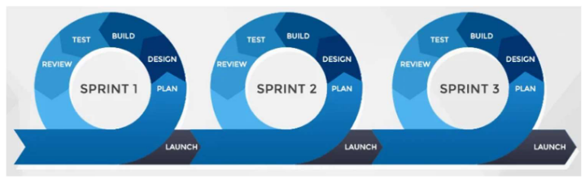

#  amep-apunts-artuaragon | TEMA 1 | DL 8 ABRIL 2024 | 

| Resum |  T1   |  T2   |
| :---: | :---: | :---: |
|   x   |   x   |   x   |

# Capitol 1. introducció a les Metodologies Agile.

## Cicle de vida del software

- Proces de desenvolupament:
    - Problema -> Proces de desenvolupament -> Solucio (Sis. Software).
    - Compost per diverses etapes:
    
    |     ETAPA     |             OBJECTIU              |                 RESULTAT                 |                  ROL                  |
    | :-----------: | :-------------------------------: | :--------------------------------------: | :-----------------------------------: |
    | Especificacio |  Definir i especificar requisits  | Document requsists; Model Especificacio  |         Enginyer de requisits         |
    |    Disseny    |  Estructurar el sistema software  | Arquitectura sistema; Components sistema |          Arquitecte software          |
    | Implementacio |   Programar el sistema software   |      Codi, Scripts, Bases de dades       |            Desenvolupador             |
    |    Proves     | Validar la correctesa del sistema |     Jocs de proves, Estudi qualitat      | Provador (tester), Gestor de qualitat |
    | Desplegament  | Posar el sistema en funcionament  |         Sistema en funcionament          | Enginyer sistemes, Administardor BDs  |
    |   Operacio    | Us del sistema pels seus usuaris  |   Sistema en us, Dades monitoritzacio    |      Operador, Analista de dades      |

    - Dirigits per un plan o Agils
      - INEP: C.V. Dirigit per un plan.
      - AMEP: C.V. Agil.

- Metodologies Agil (Agile Manisfesto, 2001):
  - INDIVIDIUALS AND INTERACTIONS over processes and tools.
  - WORKING SOFTWARE over comprehensive documentation.
  - CUSTOMER COLLABORATION over contract negotiation.
  - RESPONDING TO CHANGE over following plan.

    PRINCIPS:

    - Early and continous delivery of valuable software.
    - Changing requirements.
    - Business people and developers work together.
    - Motivated individuals.
    - Face-to-face converation.
    - Sustainable development.
    - TEchnical excellence.
    - Simplicity (Maximizing the amount of work not done).
    - Selft-organazing items.
    - Regular refelction and adjustment.
  
    Agile = Iteratiu + Incremental. (No intentar fer-ho tot be desde l'inici | No ho facis tot de cop).

### Elements caracteristics de les metodologies Agile

1. Proces

    Dirigit per iteracions (SPRINTS).
    - Incepcio.
    - Desdenvolupament.
      - A cada Iteracio de Desenvolupament: PLAN, DESIGN, BUILD, TEST, REVIEW, LAUNCH.

2. Rols

    - DEVELOPMENT TEAM:
      - Control de les seves propies taques.
      - Auto-gestio.
      - Planificacio i execucio de les iteracions.
      - Entrega del resultats acordats a temps i amb qualitat.
    - PRODUCT OWNER:
      - Comuniacio amb els stakeholders ()

3. Artefactes
4. Models
5. Tecniques
6. Cerimonia
7. Eines