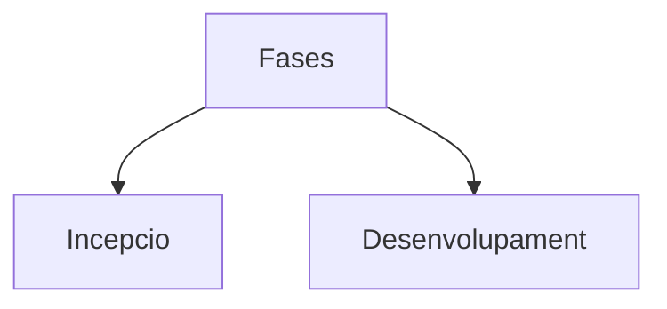
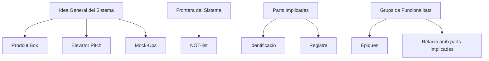
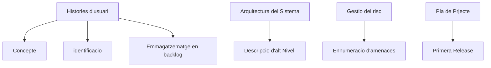

#  amep-apunts-artuaragon | TEMA 2 | DL 8 ABRIL 2024 | 

| Resums |                                    T1                                     |                                  T2                                   |
| :---: | :-----------------------------------------------------------------------: | :-------------------------------------------------------------------: |
| Link  | ) |  |

# Conceptes basics de les metodologies Agile

## SCRUM:
- Def.:
       Metodologia agil per la gestio i desenvolupament de projectes. Basada en principis iteratius i incrementals. Treball dividit en cicles curts(Sprints).

### - INCEPCIO:

- IDEA GENERAL, FRONTERA.
- Identificar PARTS IMPLICADES (stakeholders).
- Determinar GRUPS principals de FUNCIONALITATS.
- Identificar HISTORIES D'USUARI.
- Preparar ENTRON DE TREBALL.
- Visualitzar ARQUITECTURA TECNICA
- Estimar COST i fer PLANIFICACIO TEMPORAL.
- Identificar RISCOS.

- AMEP: 1 Release, 1+3 Iteracions, 14 setmanes, equip de 6-8 persones, 0 eur.

### - DESENVOLUPAMENT: